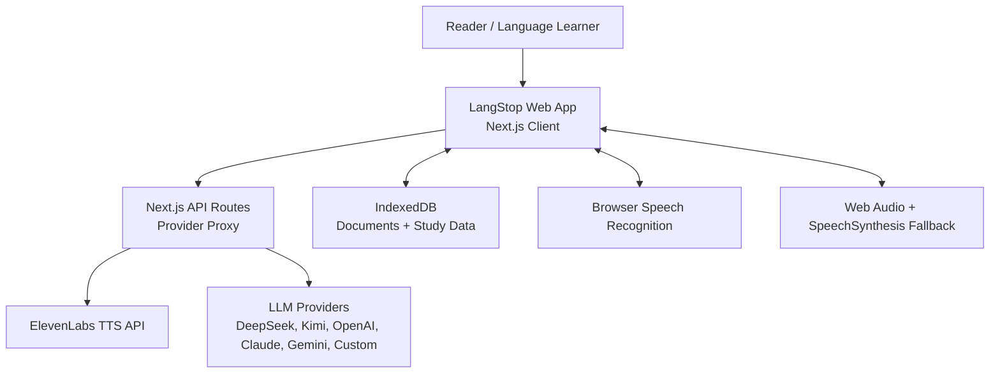
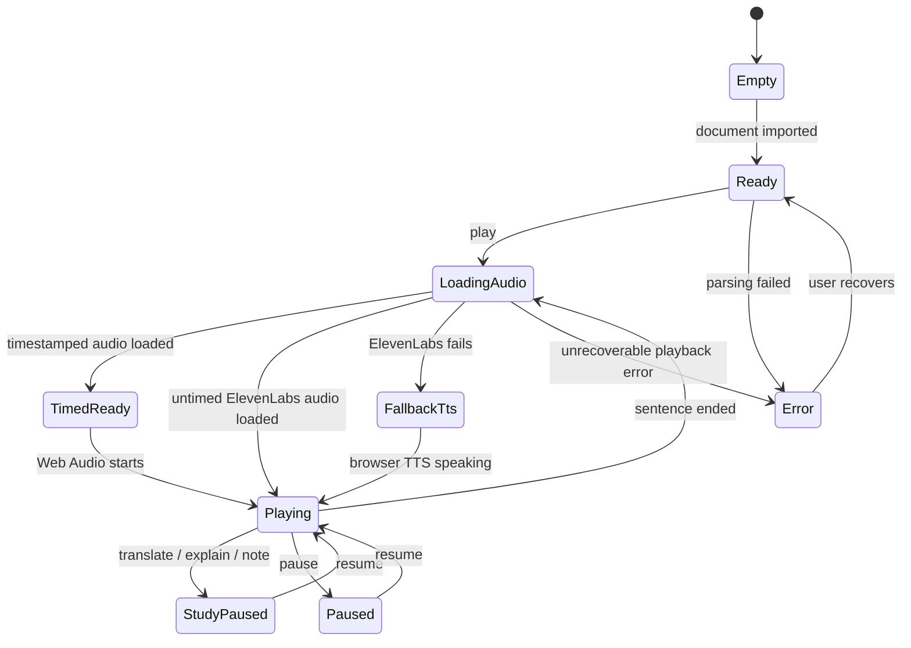
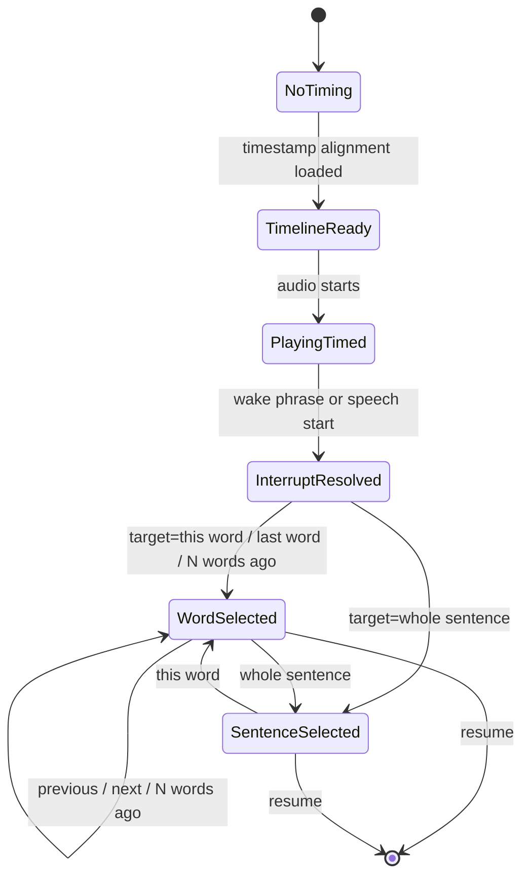
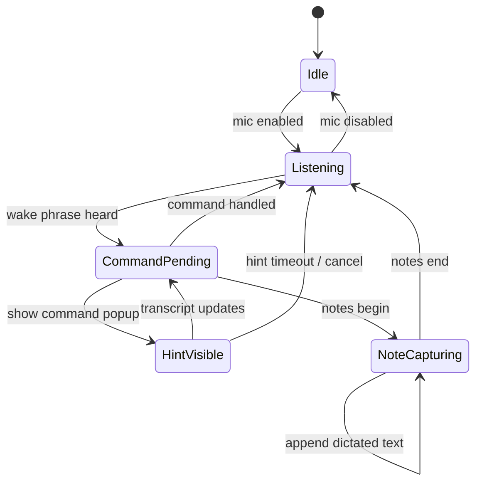

# LangStop Architecture

## Architecture Summary

LangStop should be a Next.js App Router application with a client-heavy reader and thin API routes for provider calls. The browser owns documents, playback state, local study data, and user-pasted keys. API routes proxy ElevenLabs and LLM calls per request, normalize provider behavior, and return simple response shapes to the UI.

## System Context



## Boundary Decisions

- **Client owns product state:** current document, current sentence, playback state, voice state, study tray state, settings, and local records.
- **API routes own provider calls:** ElevenLabs TTS, command interpretation, translation, explanation, flashcard generation.
- **IndexedDB owns persistence:** documents, reading positions, bookmarks, notes, study events, flashcards, and review logs.
- **No server persistence:** API keys and user content are not written server-side.

## Proposed Subsystems

### Reader Domain

Responsibilities:

- Parse imported documents.
- Normalize extracted text.
- Segment text into sentences.
- Track current sentence and progress.

### Playback Domain

Responsibilities:

- Request ElevenLabs audio for the active sentence.
- Request timestamp alignment when available.
- Prefetch upcoming sentence audio.
- Track sentence audio start time through Web Audio.
- Resolve interruption time to a word token using a latency backtrack offset.
- Fall back to browser TTS.
- Pause and resume around study interactions.

### Timed Word Selection Domain

Responsibilities:

- Convert ElevenLabs character alignment into token timing.
- Support target modes `whole_sentence` and `word_at_offset`.
- Resolve offsets such as `0`, `-1`, `-2`, and `-4` relative to the interruption token.
- Clamp relative offsets to valid token boundaries.
- Fall back to `whole_sentence` when timestamp alignment is unavailable.

### Voice Domain

Responsibilities:

- Listen for wake phrase.
- Show a context-aware command hint popup after the wake phrase.
- Capture command transcript.
- Capture dictated notes between note begin and note end.
- Dispatch normalized actions.
- Route paused refinement commands such as `last word`, `next word`, and `whole sentence`.

### Study Domain

Responsibilities:

- Store bookmarks, notes, translations, and explanations.
- Generate flashcards from LLM responses.
- Schedule and review cards using FSRS.

### Provider Domain

Responsibilities:

- Hide LLM provider differences.
- Use strict JSON prompts and schema validation.
- Support DeepSeek, Kimi/Moonshot, OpenAI, Anthropic, Google, and custom OpenAI-compatible endpoints.

## API Shape

### `POST /api/elevenlabs/tts`

Request:

```json
{
  "apiKey": "user pasted key",
  "text": "Sentence to read aloud.",
  "voiceId": "JBFqnCBsd6RMkjVDRZzb",
  "modelId": "eleven_flash_v2_5"
}
```

Response:

- `audio/mpeg`

### `POST /api/elevenlabs/tts-with-timestamps`

Request:

```json
{
  "apiKey": "user pasted key",
  "text": "Sentence to read aloud.",
  "voiceId": "JBFqnCBsd6RMkjVDRZzb",
  "modelId": "eleven_flash_v2_5"
}
```

Response:

```json
{
  "audioBase64": "base64 encoded audio",
  "alignment": {
    "characters": ["S", "e", "n"],
    "characterStartTimesSeconds": [0, 0.08, 0.14],
    "characterEndTimesSeconds": [0.08, 0.14, 0.2]
  },
  "normalizedAlignment": {
    "characters": ["S", "e", "n"],
    "characterStartTimesSeconds": [0, 0.08, 0.14],
    "characterEndTimesSeconds": [0.08, 0.14, 0.2]
  }
}
```

Notes:

- The client should prefer `normalizedAlignment` when present.
- If this route fails, playback should fall back to `/api/elevenlabs/tts`, then browser TTS.

### `POST /api/llm/command`

Request:

```json
{
  "provider": "deepseek",
  "apiKey": "user pasted key",
  "model": "deepseek-v4-flash",
  "transcript": "LangStop explain this word",
  "readerState": {
    "currentSentence": "The original sentence.",
    "interruptionToken": "original",
    "selectedTargetMode": "word_at_offset",
    "isPaused": true,
    "noteMode": false
  }
}
```

Response:

```json
{
  "action": "explain",
  "target": {
    "mode": "word_at_offset",
    "offset": 0,
    "text": "original"
  },
  "confidence": 0.82
}
```

### `POST /api/llm/study`

Request:

```json
{
  "provider": "deepseek",
  "apiKey": "user pasted key",
  "model": "deepseek-v4-flash",
  "baseUrl": "optional custom endpoint",
  "targetLanguage": "Chinese",
  "intent": "translate",
  "target": {
    "mode": "word_at_offset",
    "offset": -1,
    "text": "previous"
  },
  "sentence": "The original sentence.",
  "context": "Optional surrounding text."
}
```

Response:

```json
{
  "type": "translation",
  "translation": "Translated sentence.",
  "explanation": "Short explanation if useful.",
  "targetTerms": [
    {
      "term": "word or phrase",
      "meaning": "Native-language meaning",
      "pronunciation": "Simple pronunciation or spelling help",
      "example": "Short example sentence"
    }
  ],
  "flashcards": [
    {
      "front": "Original sentence with target term highlighted.",
      "back": "Meaning, pronunciation, and example.",
      "sourceTerm": "word or phrase"
    }
  ]
}
```

## State Machines

### Playback State



### Timed Selection State



### Voice State



## Data Model

Minimum local entities:

- `DocumentRecord`: imported document metadata and extracted sentences.
- `ReadingPosition`: document ID, sentence index, updated time.
- `Bookmark`: document ID, sentence index, sentence text, note, created time.
- `VoiceNote`: document ID, sentence index, dictated content, created time.
- `StudyEvent`: translation or explanation event linked to a sentence.
- `TimedToken`: token text, start time, end time, start char, end char, token index.
- `SelectionTarget`: `whole_sentence` or `word_at_offset`, selected token index, offset, text, timing availability.
- `Flashcard`: front, back, source term, source sentence, FSRS card state, due date.
- `ReviewLog`: flashcard ID, rating, review time, scheduling result.
