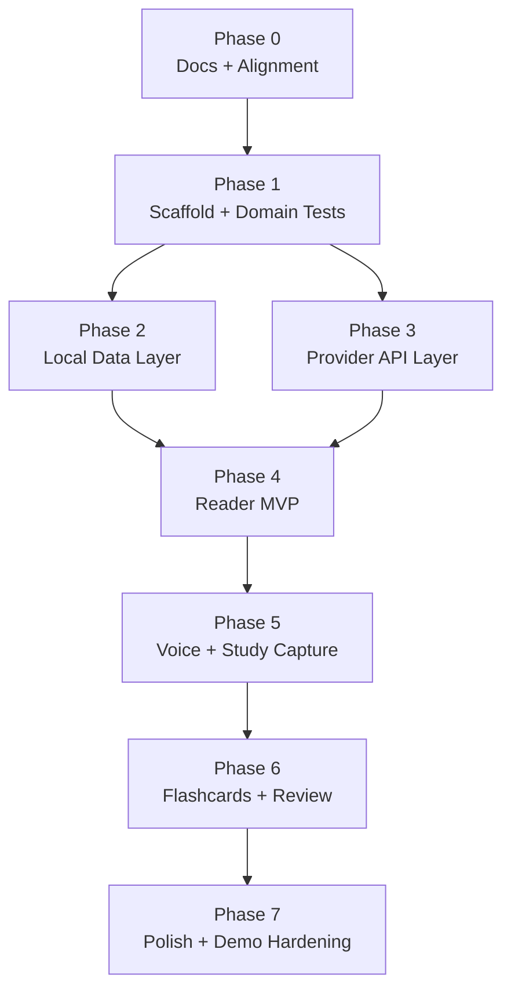

# LangStop Implementation Phases

This plan intentionally separates architecture from implementation. Each phase should end in a runnable or testable state.

## Phase 0: Documentation And Design Alignment

Goal: make sure the product, architecture, and workflows are agreed before code starts.

Deliverables:

- Product requirements document.
- Architecture document.
- Interaction workflow diagrams.
- Timed word selection design.
- Quiet Library interface brief.
- Implementation phase plan.

Exit criteria:

- Scope is limited to the capture loop.
- Backend boundary is clear: API proxy routes, not account infrastructure.
- Manual fallbacks exist for voice actions.
- Timed selection is limited to `whole_sentence` and `word_at_offset`.

## Phase 1: Project Scaffold And Core Domain Tests

Goal: create the Next.js project and test the pure logic before UI work.

Deliverables:

- Next.js + TypeScript + Tailwind scaffold.
- Vitest test setup.
- Domain modules for sentence segmentation, command action types, study response validation, and flashcard creation.
- Domain modules for character-alignment normalization, token timeline creation, relative word selection, and command hint options.
- Failing tests written before production code.

Exit criteria:

- `npm test` passes.
- `npm run lint` passes.
- No provider calls yet.

## Phase 2: Local Data Layer

Goal: persist reader and study state locally.

Deliverables:

- Dexie IndexedDB schema.
- CRUD functions for documents, positions, bookmarks, notes, study events, flashcards, and review logs.
- Tests for save/restore behavior.

Exit criteria:

- Imported sample document state can be saved and restored.
- Flashcards and review logs persist locally.

## Phase 3: Provider API Layer

Goal: isolate external provider calls behind API routes.

Deliverables:

- `/api/elevenlabs/tts`.
- `/api/elevenlabs/tts-with-timestamps`.
- `/api/llm/command`.
- `/api/llm/study`.
- Provider factory for DeepSeek, Kimi/Moonshot, OpenAI, Claude, Gemini, and custom OpenAI-compatible endpoints.
- Zod schemas for all request and response shapes.

Exit criteria:

- API route tests pass with mocked providers.
- Keys are accepted per request and never persisted server-side.
- Provider errors produce user-safe error messages.

## Phase 4: Reader MVP

Goal: build the first end-to-end reading loop.

Deliverables:

- Document import UI.
- PDF and EPUB extraction.
- Sentence list and current sentence highlight.
- Play, pause, previous, next, speed controls.
- ElevenLabs playback with browser TTS fallback.
- Timed playback path that stores sentence audio start time and token timeline.

Exit criteria:

- User can import a document and hear sentence-by-sentence narration.
- Playback can recover from a failed ElevenLabs request.
- When timestamp data is available, the app can identify the selected word near the interruption point.

## Phase 5: Voice And Study Capture

Goal: connect voice interruption to useful study actions.

Deliverables:

- Wake phrase listener.
- Real-time command hint popup after `LangStop`.
- LLM command parser.
- Bookmark creation.
- Note begin/end capture.
- Translation and explanation annotations.
- Study Tray entries.

Exit criteria:

- User can say `LangStop translate`, see a whole-sentence annotation, refine to `last word` or `this word`, ask one follow-up, and resume.
- User can create a bookmark and save a dictated note.
- Manual controls mirror voice actions.

## Phase 6: Flashcards And Review

Goal: convert captured language moments into a small review loop.

Deliverables:

- Auto-created context vocab cards.
- Undo action for newly created cards.
- Due review list.
- FSRS scheduling with Again, Hard, Good, Easy.

Exit criteria:

- Translation or explanation can create a flashcard.
- User can review a due card and update its next due date.

## Phase 7: Quiet Library Polish And Demo Hardening

Goal: make the hackathon demo feel product-grade.

Deliverables:

- Quiet Library visual styling.
- Responsive desktop and mobile layouts.
- First-run setup sheet.
- Empty, loading, error, and fallback states.
- Demo script and known limitations.

Exit criteria:

- Full demo path works without code changes.
- Browser screenshot checks pass on desktop and mobile.

## Dependency Graph

## Recommended Build Order

Do not start with the prettiest UI. Start with the smallest vertical slice:

1. Import plain sample text and segment it.
2. Play one sentence with browser TTS.
3. Add ElevenLabs TTS route.
4. Add timestamped ElevenLabs route and token timeline tests.
5. Add local persistence.
6. Add translation route.
7. Add voice command parsing and command hint popup.
8. Add flashcards and FSRS.
9. Polish the interface.
