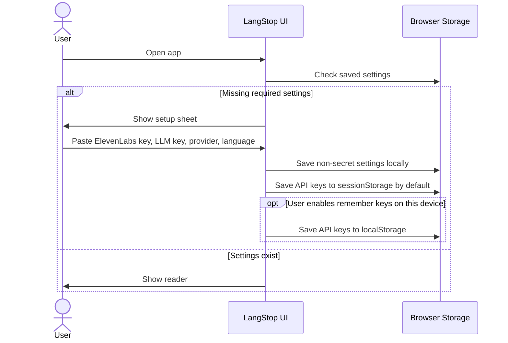
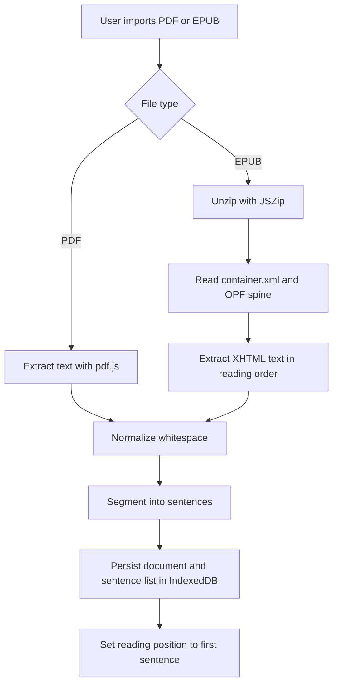
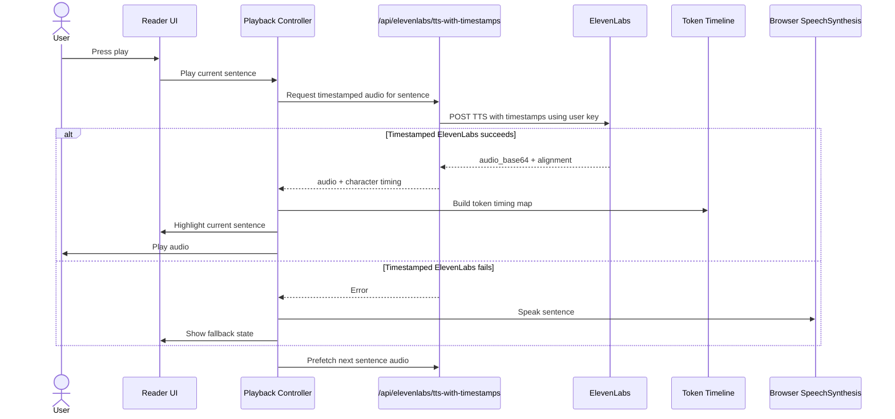
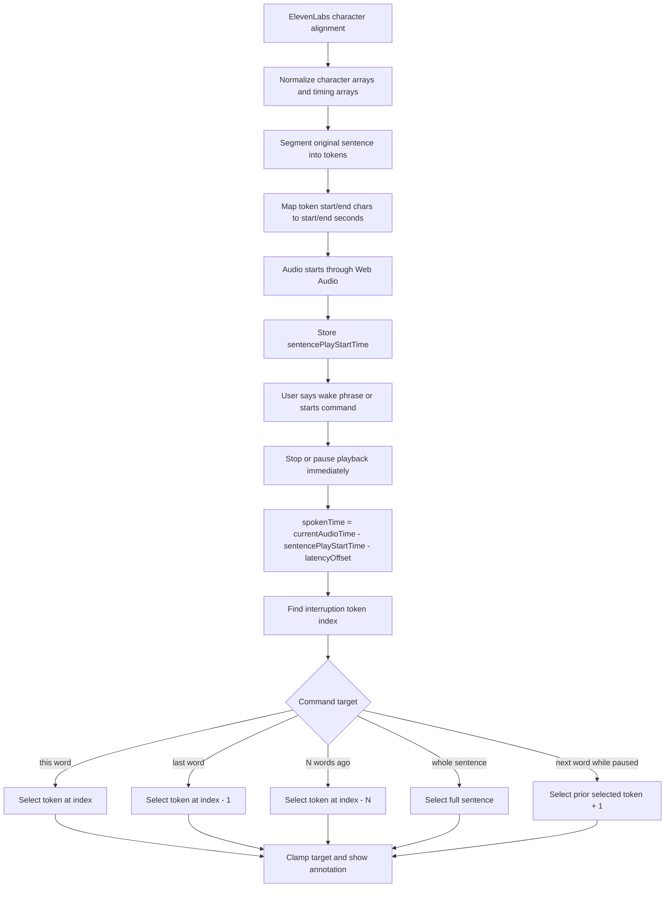
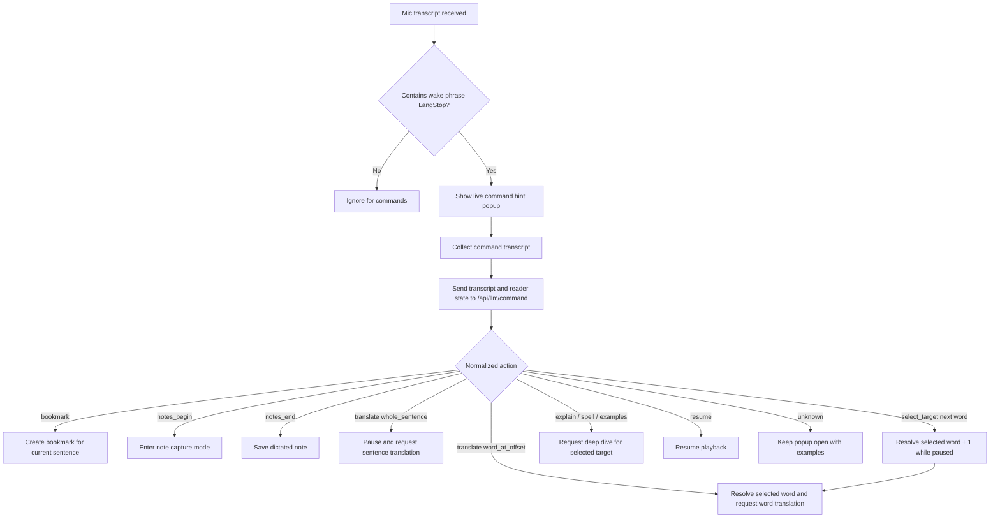
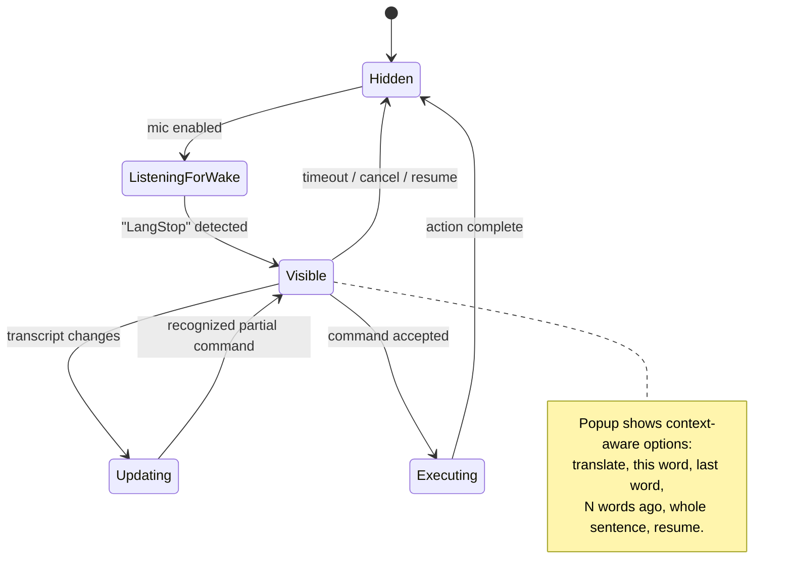
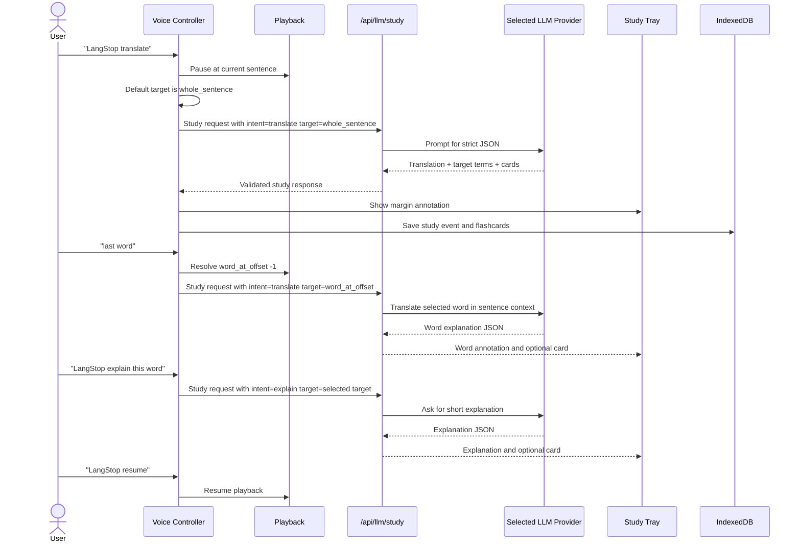
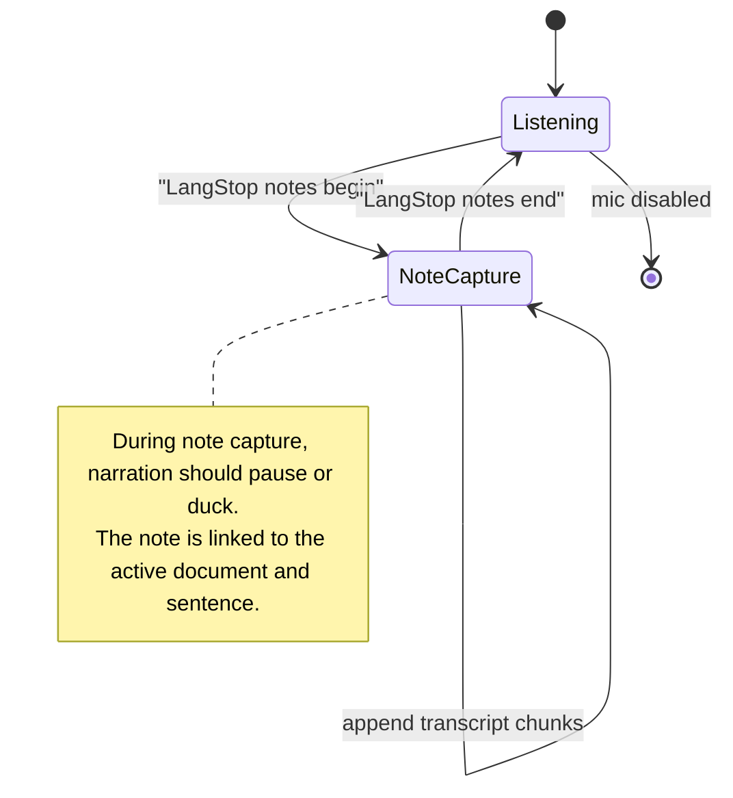
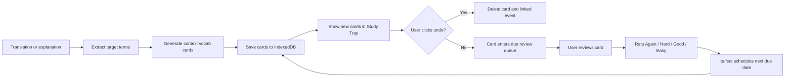
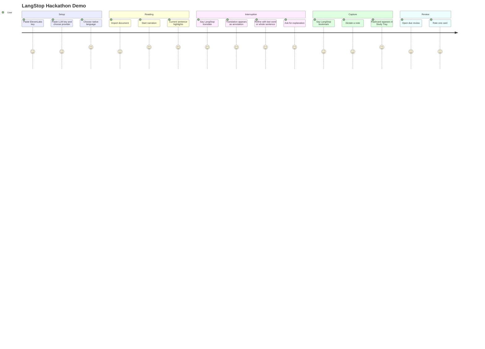

# LangStop Interaction Workflows

This document captures the main workflows LangStop must support. These diagrams should be treated as product and engineering source of truth until implementation begins.

## First-Run Setup

## Document Import And Sentence Preparation

## Sentence Playback

## Timed Word Selection

## Voice Command Routing

## Command Hint Popup

## Translate And Deep Dive

## Dictated Notes

## Flashcard Creation And Review

## End-To-End Demo Path

