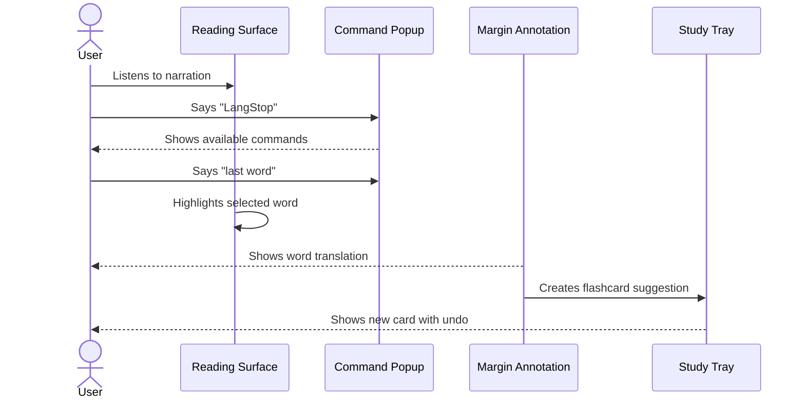

# Quiet Library Interface

Quiet Library is the visual and interaction direction for LangStop. The app should feel like a refined reading desk: calm, literary, precise, and modern enough to make the AI voice layer feel intentional rather than bolted on.

## Design Principles

- **Document first:** the reading surface is the center of the product.
- **AI as annotation:** translations and explanations should appear like smart study notes, not chat bubbles competing with the text.
- **Voice controls stay calm:** command hints are visible when useful, then disappear.
- **Study capture feels immediate:** bookmarks, notes, and flashcards should appear in the Study Tray without turning the reader into a dashboard.
- **No generic AI aesthetic:** avoid purple gradients, oversized hero sections, marketing layouts, and busy glassmorphism.

## Visual Direction

Palette:

- **Ink:** primary text and strong UI labels.
- **Ivory:** main reading surface.
- **Sage:** secondary surfaces, Study Tray, quiet metadata, language chips.
- **Copper:** active states, current sentence edge, selected word, microphone listening, translation badge, progress.

Typography:

- Use a distinctive, readable serif for document text.
- Use a restrained sans-serif for controls, settings, metadata, and command hints.
- Document text should feel editorial and comfortable for long reading.
- UI text should stay compact and legible; no hero-scale type inside controls or trays.

Texture and depth:

- Subtle paper texture is allowed.
- Use restrained shadows and borders to separate reader, tray, and floating controls.
- Do not use decorative gradient blobs or purely atmospheric backgrounds.

## Main Reader Layout

Desktop:

- Top-left: small LangStop wordmark.
- Top-right: import, settings, and key/provider status.
- Center: document page with generous margins.
- Bottom center: floating playback bar.
- Right side: collapsible Study Tray.
- Translation annotations appear in the right margin aligned to the active sentence.

Mobile:

- Single-column reader.
- Playback controls become a compact bottom sheet.
- Study Tray becomes a bottom drawer.
- Translation annotations appear inline below the active sentence.
- Command popup appears above the bottom controls.

## Core Components

### First-Run Setup Sheet

Purpose: make BYOK feel intentional, not broken.

Fields:

- ElevenLabs API key.
- LLM API key.
- LLM provider: DeepSeek, Kimi, OpenAI, Claude, Gemini, custom OpenAI-compatible.
- Model.
- Native language.
- Voice selection.
- Remember keys toggle.

Behavior:

- Defaults to session-only key storage.
- Persists non-secret settings without requiring the user to re-enter them.
- Stores API keys durably only when `Remember keys` is enabled.
- Offers a clear `Clear keys` action in settings.
- Collapses into the reader after setup is complete.

### Reading Surface

The reading page should look like a premium document canvas, not a card grid. Current sentence highlighting should be subtle:

- Whole active sentence: soft copper or sage wash.
- Selected word: copper underline or edge mark.
- Translation target state should clearly show `This Word` or `Whole Sentence`.

### Playback Bar

Controls:

- Play/pause.
- Previous sentence.
- Next sentence.
- Speed.
- Voice/model status.
- Microphone state.
- Translate action.

Use icons where possible, with tooltips for less obvious controls.

### Command Hint Popup

Shown after the wake phrase `LangStop`.

During playback:

- `translate`
- `this word`
- `last word`
- `2 words ago`
- `bookmark`
- `notes begin`

While paused:

- `this word`
- `last word`
- `next word`
- `whole sentence`
- `explain`
- `resume`

Presentation:

- Small floating panel near active sentence or playback bar.
- Uses copper for the currently recognized/likely command.
- Uses sage for available alternatives.
- Has clickable chips mirroring voice commands.
- Times out quietly if no command follows.

### Translation Annotation

Desktop:

- Appears as a margin note aligned to the active sentence.
- Shows target mode: `This Word` or `Whole Sentence`.
- Shows provider/model in small metadata.
- Includes quick actions: explain, spell, examples, make/remove card.

Mobile:

- Appears inline below the selected sentence.
- Keeps the selected word visible.
- Does not cover the reading text.

### Study Tray

Purpose: show the payoff of reading moments becoming study material.

Sections:

- Bookmarks.
- Notes.
- Recent translations/explanations.
- New flashcards with undo.
- Due review list.

The tray should be useful but secondary. It should not dominate the reader.

## Signature Interaction

## Claude Design Prompt

Create a responsive web app interface for **LangStop**, an AI-assisted document reader for PDFs and EPUBs. The visual direction is **Quiet Library**: refined, calm, literary, and focused. Use an **ink, ivory, sage, and copper** palette. Avoid generic AI gradients, oversized marketing hero sections, and cluttered dashboards.

The main screen should center a beautiful document reading surface. On desktop, the page should feel like a premium reading canvas with generous margins. On mobile, it should become a clean single-column reader with controls in a compact bottom sheet.

The current sentence should be highlighted subtly, like a guided reading marker. When the user interrupts for translation, show the translation as a **margin annotation** on desktop and an inline annotation below the sentence on mobile. It should feel like a smart study note, not a chatbot.

Include a polished first-run setup sheet where users paste:

- ElevenLabs API key
- LLM API key
- LLM provider: DeepSeek, Kimi, OpenAI, Claude, Gemini, or custom OpenAI-compatible
- Native language
- Voice selection

After setup, the UI should collapse into the reader. Settings should remain accessible through a small icon button.

The interface must include the live command hint popup after the user says `LangStop`, with options for `translate`, `this word`, `last word`, `2 words ago`, `whole sentence`, `bookmark`, `notes begin`, and `resume` depending on context.

## Acceptance Criteria

- The reader is the dominant first-screen element.
- Desktop and mobile layouts both preserve reading focus.
- Every voice command has a visible manual control.
- Translation target state is obvious: word or sentence.
- Study Tray shows captured artifacts without feeling like a separate dashboard.
- The UI reads as literary, calm, and modern, not generic AI SaaS.
