# Software Development Process

Large software teams do not usually jump from idea to full implementation in one pass. The exact names vary by company, but the shape is usually similar: reduce ambiguity first, then design the architecture, then build in thin verified slices.

## Typical Company-Style Phases

1. **Problem Framing**
   - Clarify user, pain point, business/demo goal, and non-goals.
   - Output: product brief or one-page PRD.

2. **Requirements**
   - Define functional requirements, acceptance criteria, constraints, and risks.
   - Output: PRD, user stories, success metrics.

3. **Experience Design**
   - Explore information architecture, flows, states, and visual direction.
   - Output: wireframes, design system choices, interaction notes.

4. **Technical Design**
   - Define system boundaries, data model, APIs, state machines, dependencies, and failure handling.
   - Output: architecture design doc and review notes.

5. **Implementation Planning**
   - Break the build into milestones and tasks with clear verification points.
   - Output: phased implementation plan, test plan, owners.

6. **Build In Slices**
   - Build the smallest end-to-end path first, then add capabilities.
   - Output: reviewed pull requests, passing tests, demoable increments.

7. **Hardening**
   - Fix edge cases, performance issues, accessibility gaps, and failure states.
   - Output: QA checklist, bug fixes, release notes.

8. **Launch / Demo**
   - Prepare a scripted happy path and a fallback path.
   - Output: demo script, deployment, known limitations.

## LangStop Adaptation

LangStop is a hackathon product, so the process should be lighter than an enterprise release but still phased:

- **Docs first:** PRD, architecture, workflows, and implementation phases.
- **Core loop second:** import document, read sentence, interrupt, translate, resume.
- **Capture loop third:** bookmarks, dictated notes, explanations, flashcards.
- **Polish last:** Quiet Library visual design, responsive layout, demo script.

## Phase Gate

```mermaid
flowchart LR
    A["Idea"] --> B["PRD"]
    B --> C["Architecture"]
    C --> D["Workflow Diagrams"]
    D --> E["Implementation Phases"]
    E --> F["Build Core Loop"]
    F --> G["Build Capture Loop"]
    G --> H["Hardening"]
    H --> I["Demo"]

    B -. "User value clear?" .-> C
    C -. "Boundaries clear?" .-> D
    E -. "Tasks testable?" .-> F
```

## Working Rule

For this project, do not scaffold or implement features before the architecture and workflow docs are accepted. Once accepted, implementation should proceed by phase, with each phase ending in a runnable app state.

