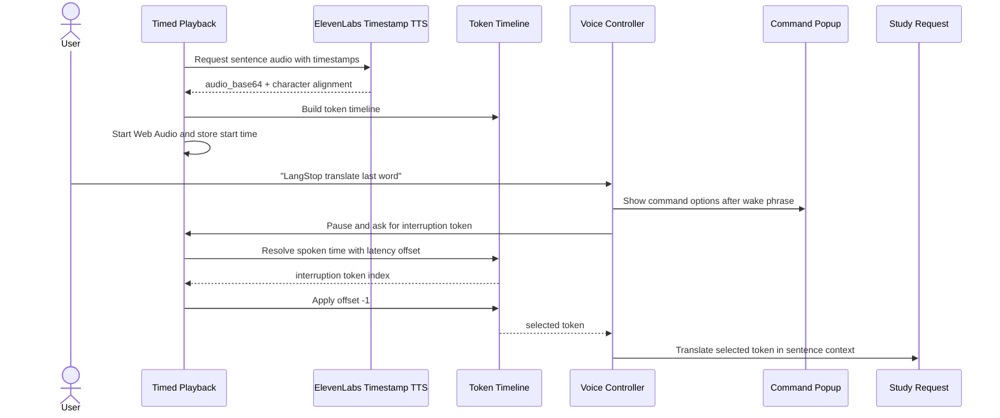
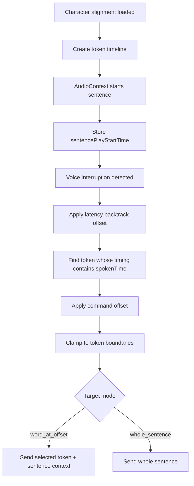

# Timed Word Selection

Timed word selection lets LangStop translate either the whole sentence or a specific word near the interruption point. This is the precision layer behind commands such as `LangStop translate this word`, `last word`, and `4 words ago`.

## Product Rule

The MVP supports two translation target modes:

- `whole_sentence`: translate the active sentence.
- `word_at_offset`: translate a token resolved from the interruption point.

Offsets are relative to the token being spoken when the interruption is detected:

- `0`: this word.
- `-1`: last word.
- `-2`: 2 words ago.
- `-4`: 4 words ago.
- `+1`: next word, only available while paused after a word selection.

## Voice Commands

Preferred commands:

- `LangStop translate`: translate the whole sentence.
- `LangStop translate this word`: translate the current aligned word.
- `LangStop translate last word`: translate the previous word.
- `LangStop translate 4 words ago`: translate the word four tokens before the interruption point.

Paused refinement commands:

- `this word`
- `last word`
- `next word`
- `2 words ago`
- `whole sentence`
- `resume`

The phrase `last last word` can be treated as an alias for `2 words ago`, but the UI should teach `2 words ago`.

## Data Flow

## Selection Algorithm

## Command Popup Behavior

The command popup is a small contextual UI shown immediately after `LangStop` is detected. It should not block the document; it should float near the active sentence or playback controls.

Default options during playback:

- `translate`
- `this word`
- `last word`
- `2 words ago`
- `bookmark`
- `notes begin`

Default options while paused after translation:

- `this word`
- `last word`
- `next word`
- `whole sentence`
- `explain`
- `resume`

The popup should update as partial speech arrives. If the recognized command is unknown, the popup remains visible and highlights examples rather than showing a hard error.

## Fallbacks

- If timestamp alignment is unavailable, hide or disable word commands and use `whole_sentence`.
- If the interruption token cannot be resolved, select the nearest previous token.
- If the selected offset goes before the first token, select the first token.
- If the selected offset goes after the last token, select the last token.
- If speech recognition fails, all command popup actions must still be available as buttons.

## Implementation Notes

- Use ElevenLabs timestamp-capable TTS for aligned playback.
- Prefer `normalized_alignment` when available.
- Build tokens with `Intl.Segmenter` where supported; fall back to whitespace tokenization for space-separated languages.
- Keep `vadLatencyOffsetSeconds` configurable, starting at `0.2`.
- Do not build word-by-word karaoke highlighting for the MVP. Only highlight the selected word after interruption.
